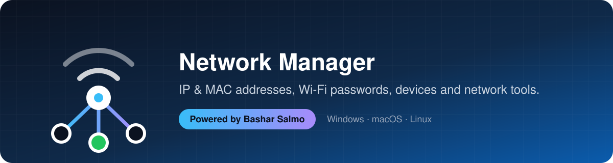
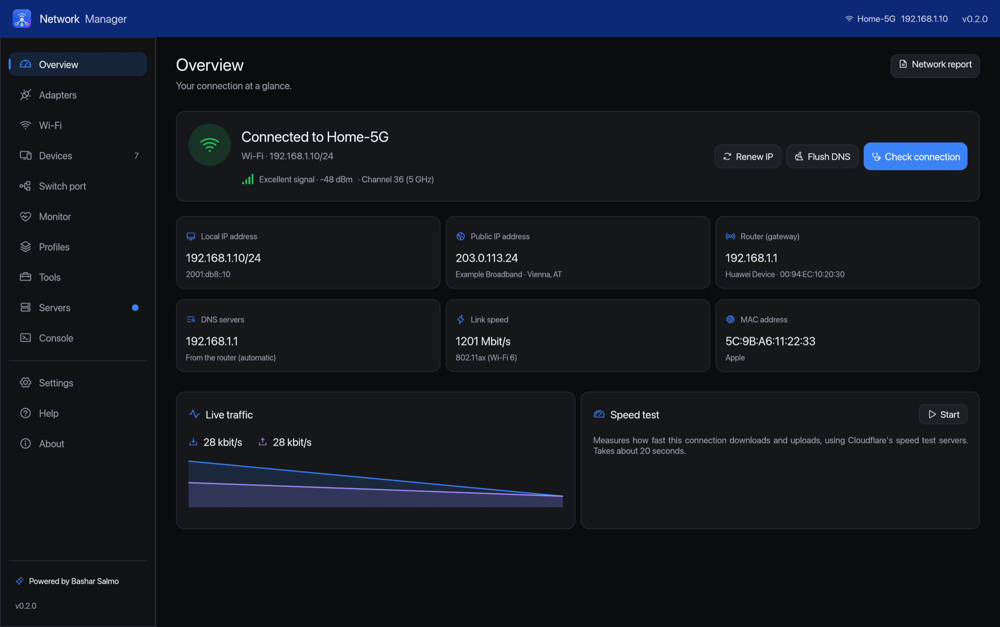
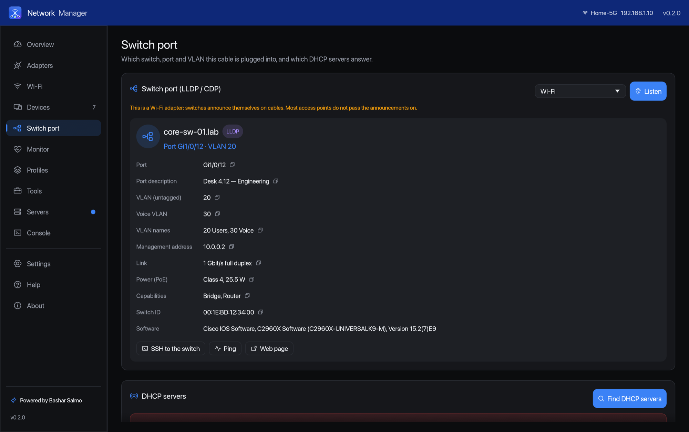
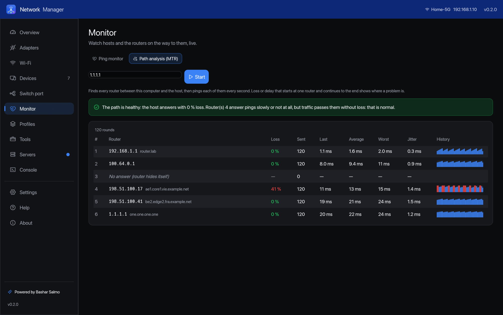
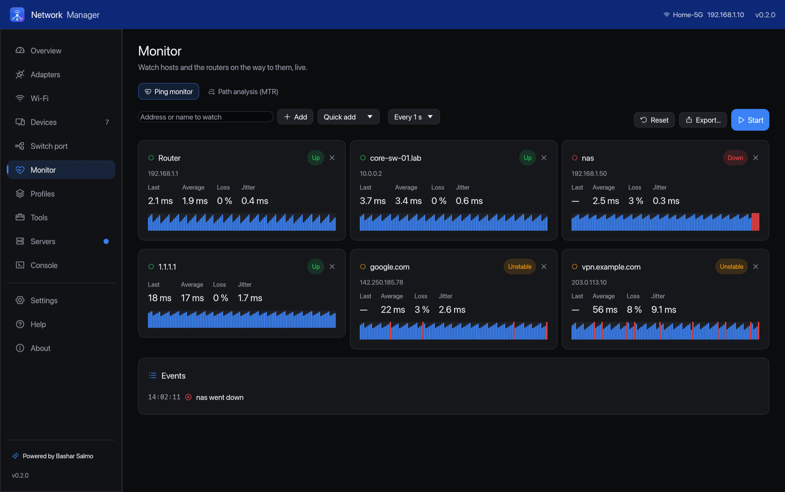
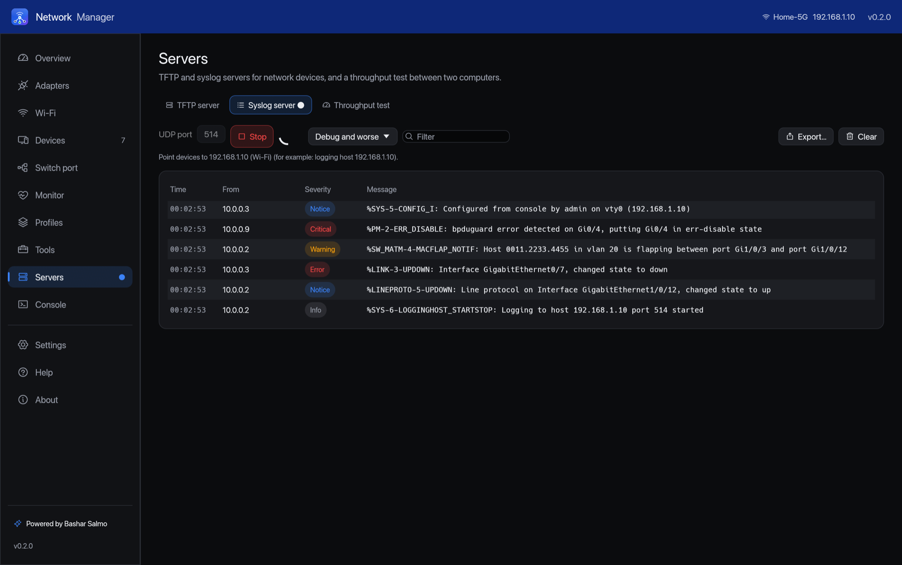
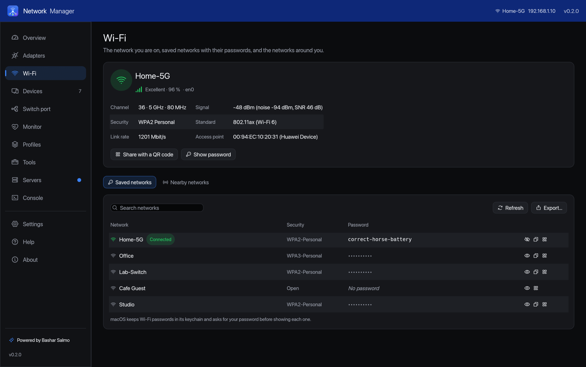
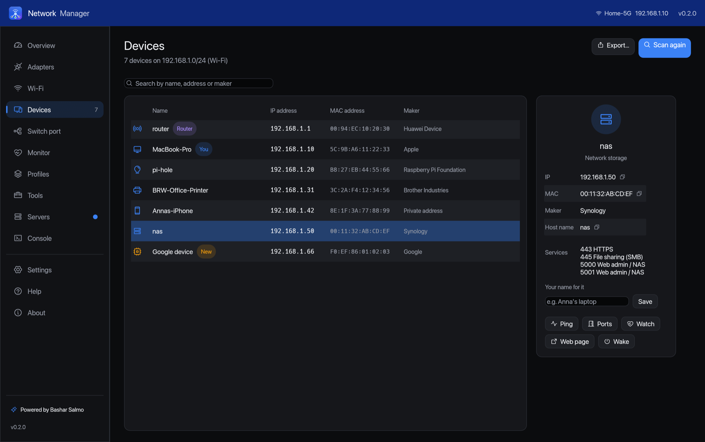
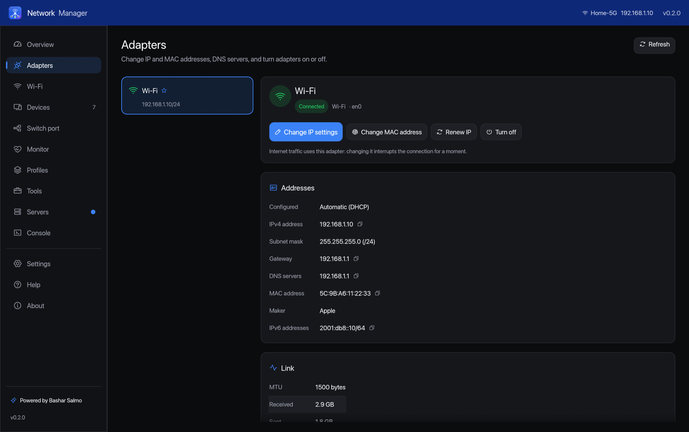
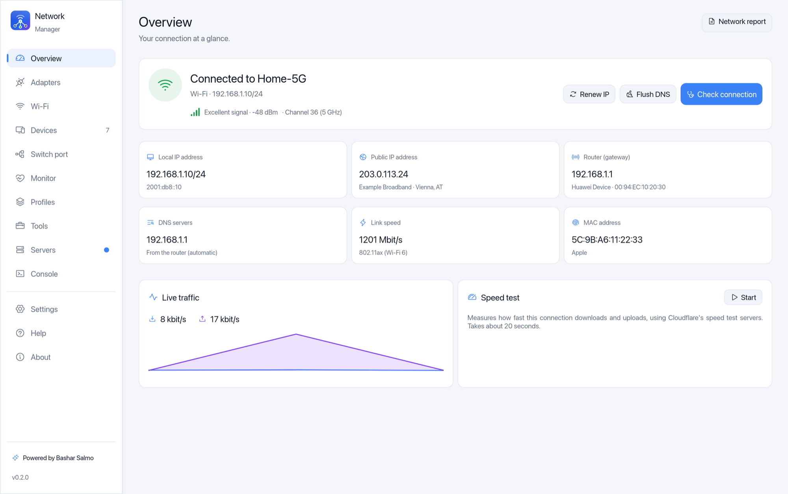

<div align="center">



<br>

[](https://github.com/itsmrroot/Network-Manager/actions/workflows/ci.yml)
[](https://github.com/itsmrroot/Network-Manager/releases/latest)
[](https://github.com/itsmrroot/Network-Manager/releases)
[](#-install)
[](https://www.rust-lang.org)
[](LICENSE)

**Change IP and MAC addresses, see saved Wi-Fi passwords, find every device on your network, see which switch port<br>you are plugged into, watch hosts and paths, and run TFTP, syslog and a console — in one modern app.**

[](#-windows)
[](#-macos)
[](#-linux)

[Features](#-features) •
[Quick start](#-quick-start) •
[Install](#-install) •
[Desktop app](#%EF%B8%8F-the-desktop-app) •
[Command line](#-command-line) •
[How it works](#%EF%B8%8F-how-it-works) •
[FAQ](#-faq) •
[Roadmap](#%EF%B8%8F-roadmap)

</div>

---

<div align="center">

</div>

## ✨ Features

<table>
<tr>
<td width="50%" valign="top">

### 🔌 IP addresses in two clicks
Switch any adapter between **automatic (DHCP)** and a **fixed address**, set the
gateway and **DNS servers** (Cloudflare, Google, Quad9, OpenDNS, AdGuard in one
click). Mistakes are caught before they are applied — wrong subnet, gateway
outside the network — and every change has an **Undo**.

</td>
<td width="50%" valign="top">

### 🗂️ Profiles
Save settings as profiles — *Office*, *Home*, *Lab switch 192.168.1.50/24* — and
apply them to any adapter in one click. The same profiles work from the command
line: `netmgr profile apply Office`.

</td>
</tr>
<tr>
<td valign="top">

### 🪪 MAC addresses
Give an adapter a **random private address**, type your own, or borrow the
prefix of a maker (from the built-in IEEE registry of **40,000+ vendors**).
**Restore original** brings the factory address back, and the app remembers it
before the first change.

</td>
<td valign="top">

### 🔑 Saved Wi-Fi passwords
Every network this computer has joined, with its password — show, copy, **share
with a QR code** that phones scan to join, or export to CSV. Also: the current
network's signal, channel, band, security and Wi-Fi standard.

</td>
</tr>
<tr>
<td valign="top">

### 📡 Who is on my network?
Finds **every device** on the network — even ones that ignore ping — with its IP,
MAC, **maker**, name (from the router, Bonjour/mDNS and NetBIOS) and a guess of
what it is: phone, printer, TV, NAS… **New** devices are marked, and you can name
the ones you know.

</td>
<td valign="top">

### 🩺 "Why is my internet down?"
**Check connection** walks through adapter → address → router → DNS → internet,
stops at the step that fails and says what to do — including hotel and café
**login pages**. Plus **Renew IP** and **Flush DNS** buttons, and a **speed test**.

</td>
</tr>
<tr>
<td valign="top">

### 🧰 Network engineer's toolbox
**Ping** with live chart, loss and jitter · **Traceroute** · **DNS lookup** of any
record at any server, with **side-by-side comparison** of public resolvers ·
**Port check** with presets · **Subnet calculator** with VLSM splitting ·
**Wake-on-LAN** · **MAC vendor lookup**.

</td>
<td valign="top">

### 📶 Wi-Fi around you
Nearby networks with signal, channel, band and security, a **channel-usage chart**
for 2.4, 5 and 6 GHz, and the **least crowded** 2.4 GHz channel (1, 6 or 11) to
set on your router.

</td>
</tr>
<tr>
<td valign="top">

### 🖥️ Modern desktop app
The same design as [Deleted Files Recovery](https://github.com/itsmrroot/Recover-Deleted-Files):
**Midnight** (default), dark and light themes, accent colours, interface size, a
Help page with step-by-step guides, and **one-click updates**.

</td>
<td valign="top">

### ⚡ Native, fast & honest
Written in **Rust**: one small native app per system, no runtime, no background
service. Settings are changed with the system's own tools (`netsh`,
`networksetup`, `nmcli`), so the system stays in charge of its configuration.

</td>
</tr>
<tr>
<td valign="top">

### 🔌 Which switch port am I on?
Listens to what the switch announces (**LLDP** and **CDP**) and shows the
**switch name, port, VLAN, voice VLAN, PoE, link speed** and its **management
address** — with one click to SSH into it. On Windows, macOS **and** Linux.

</td>
<td valign="top">

### 🕵️ DHCP test & rogue servers
Asks the network for an address and lists **every DHCP server** that answers,
with the address, router, DNS and lease it offers. Two servers? You have a
**rogue DHCP server** — and now you know its address. Nothing is changed.

</td>
</tr>
<tr>
<td valign="top">

### 📈 Ping monitor
Watch servers, switches, printers and the internet **all at once**: delay,
loss, jitter and a history bar for each, **alerts when one goes down** and when
it comes back, and CSV export. Native ICMP — no admin rights needed.

</td>
<td valign="top">

### 🛣️ Path analysis (MTR)
Every router on the way to a host, pinged every second, with loss, delay,
worst case and jitter per hop — and a plain-language **verdict**: where the
loss really starts, and which routers merely ignore pings.

</td>
</tr>
<tr>
<td valign="top">

### 📦 TFTP & syslog servers
A built-in **TFTP server** (with large-file block sizes) for firmware upgrades
and configuration backups — with ready-made Cisco, Aruba and Juniper commands —
and a **syslog server** with severity colours, filters and export.

</td>
<td valign="top">

### 🖥️ Serial console & SSH
**Console cables** with a real terminal: every key goes to the device, so Tab,
`?` and Ctrl+Shift+6 work; **send break** for password recovery, paste a whole
configuration, log to file. **SSH / Telnet** open in your terminal.

</td>
</tr>
<tr>
<td valign="top">

### 🔒 Web, TLS & WHOIS
Certificate chain, **expiry**, trust and TLS version; every **redirect** with
its security headers; **WHOIS/RDAP** for domains, IP addresses and AS numbers —
registrar, network range, organisation and abuse contact.

</td>
<td valign="top">

### 🧭 Connections, routes, hosts & reports
Which program **listens on which port**; the **route table** with add and
delete; a **hosts file editor** with automatic backup; a **throughput test**
between two computers; and a one-click **network report** for tickets.

</td>
</tr>
</table>

> [!NOTE]
> **Why these features?** Before building, we looked at what people and network engineers ask for. The
> popular IP switchers (NetSetMan, TCP/IP Manager), MAC changers (Technitium TMAC), Wi-Fi key viewers
> (WirelessKeyView) and engineer toolboxes (NETworkManager) are each **Windows-only** and each do one part.
> The most requested items — one-click **IP profiles**, **MAC spoofing with restore**, **saved Wi-Fi
> passwords with QR sharing**, a **"who's on my Wi-Fi"** scanner with vendors and new-device alerts, a guided
> **connectivity check**, and the engineer basics (ping, traceroute, DNS, ports, subnets, WoL) — are combined
> here, on **Windows, macOS and Linux**. Version 0.2 adds what field engineers carry separate tools for:
> **LLDP/CDP** port discovery (LDWin, PortFinder, a LinkSprinter), **rogue DHCP** detection, **MTR/PingPlotter**-style
> path analysis, a multi-host **ping monitor**, **Tftpd64**-style TFTP and syslog servers, an **iperf**-style
> throughput test, a **PuTTY**-style serial console, TLS and WHOIS checks, and netstat, route and hosts tools.

## 🚀 Quick start

1. **Install** the app for your system: **[Windows](#-windows)** · **[macOS](#-macos)** · **[Linux](#-linux)**.
2. Open **Network Manager**. Windows asks for administrator rights: click **Yes**. On macOS, allow
   **Local Network** access when asked. On macOS and Linux, the system asks for your password when you change
   a setting.
3. The **Overview** shows your connection. Use **Adapters** to change IP or MAC addresses, **Wi-Fi** for
   passwords, **Devices** to see who is on your network.

> [!TIP]
> Prefer the keyboard? **`netmgr`** (included in every download) does everything from the command line —
> `netmgr --help`.

## 🖥️ The desktop app

| Page | What it does |
|---|---|
| **Overview** | Connected network and signal, local and public IP (with provider and location), router, DNS, link speed, MAC address, live traffic, **Check connection**, **Renew IP**, **Flush DNS**, speed test. |
| **Adapters** | Every adapter with its status, addresses, DNS, MAC and maker, link speed, MTU and traffic. **Change IP settings**, **Change MAC address**, **Renew IP**, **Turn on/off**, **Undo**. |
| **Wi-Fi** | The current network in detail; **saved networks with passwords** (show, copy, QR, export); **nearby networks** with a channel chart. |
| **Devices** | Every device on the network with IP, MAC, maker, name and services; new devices marked; your own names for devices; ping, ports, web page and Wake-on-LAN per device; CSV export. |
| **Switch port** | The switch, port, VLAN, voice VLAN, PoE and management address of this cable (LLDP/CDP); every DHCP server on the network. |
| **Monitor** | Ping monitor for many hosts with alerts and export; path analysis (MTR) with a verdict. |
| **Profiles** | Saved IP settings applied to any adapter in one click; shared with the command line. |
| **Tools** | Ping, Traceroute, DNS lookup (compare resolvers), Port check, Subnet calculator, Wake-on-LAN, MAC lookup, Web & TLS check, WHOIS, Connections, Routes, Hosts file. |
| **Servers** | TFTP server, syslog server, throughput test between two computers. |
| **Console** | Serial console for console cables; SSH and Telnet launcher. |

<table>
<tr>
<td width="50%"><p align="center"><sub>Switch port (LLDP / CDP)</sub></p></td>
<td width="50%"><p align="center"><sub>Path analysis (MTR)</sub></p></td>
</tr>
<tr>
<td width="50%"><p align="center"><sub>Ping monitor</sub></p></td>
<td width="50%"><p align="center"><sub>Syslog server</sub></p></td>
</tr>
<tr>
<td width="50%"><p align="center"><sub>Wi-Fi: saved networks and passwords</sub></p></td>
<td width="50%"><p align="center"><sub>Devices on your network</sub></p></td>
</tr>
<tr>
<td width="50%"><p align="center"><sub>Adapters</sub></p></td>
<td width="50%"><p align="center"><sub>Light mode</sub></p></td>
</tr>
</table>

**Settings** (saved automatically): theme (Midnight / dark / light / system), accent colour, interface size,
showing virtual adapters, finding device names and services during scans, forgetting known devices, pings per
test, the public IP lookup and the update check.

## 📥 Install

Every installer contains the desktop app **and** the command line (`netmgr`). All files are also on the
**[latest release](https://github.com/itsmrroot/Network-Manager/releases/latest)** page.

### 🪟 Windows

| Your PC | Download |
|---|---|
| **Most PCs** (Intel or AMD) | **[netmgr-windows-x64-setup.exe](https://github.com/itsmrroot/Network-Manager/releases/latest/download/netmgr-windows-x64-setup.exe)** |
| ARM laptops (Snapdragon, Surface Pro X) | [netmgr-windows-arm64-setup.exe](https://github.com/itsmrroot/Network-Manager/releases/latest/download/netmgr-windows-arm64-setup.exe) |

1. Double-click the downloaded file. If Windows shows **"Windows protected your PC"**, click **More info → Run
   anyway** (the app is new and not code-signed yet).
2. Click **Next → Install**, and **Yes** when Windows asks for permission.
3. Open **Start menu → Network Manager** and click **Yes** for administrator rights (needed to change network
   settings and read Wi-Fi passwords).

<sub>**Uninstall:** Settings → Apps → Installed apps → *Network Manager* → Uninstall.</sub>

### 🍎 macOS

| Your Mac | Download |
|---|---|
| **Apple Silicon** (M1 and newer) | **[netmgr-macos-apple-silicon.dmg](https://github.com/itsmrroot/Network-Manager/releases/latest/download/netmgr-macos-apple-silicon.dmg)** |
| Intel | [netmgr-macos-intel.dmg](https://github.com/itsmrroot/Network-Manager/releases/latest/download/netmgr-macos-intel.dmg) |

1. Open the `.dmg` and drag **Network Manager** onto **Applications**.
2. The first time, macOS blocks the app because it is not signed by Apple yet:
   - **macOS 15 and newer:** open the app, click **Done**, then **System Settings → Privacy & Security →
     Open Anyway**.
   - **macOS 14 and older:** right-click the app → **Open** → **Open**.
3. Allow **Local Network** access when macOS asks (or later in **System Settings → Privacy & Security → Local
   Network**). Without it, macOS hides MAC addresses and the devices on your network from the app.

> [!NOTE]
> macOS hides the **name** of the current Wi-Fi network from apps. Click **Show name** on the Wi-Fi page and
> enter your password to see it. Wi-Fi passwords come from the keychain: macOS asks for your password before
> showing each one.

### 🐧 Linux

| Your distribution | Intel / AMD (`x86_64`) | ARM (`aarch64`) |
|---|---|---|
| **Ubuntu, Debian, Mint, Pop!_OS** | **[netmgr-linux-x86_64.deb](https://github.com/itsmrroot/Network-Manager/releases/latest/download/netmgr-linux-x86_64.deb)** | [netmgr-linux-arm64.deb](https://github.com/itsmrroot/Network-Manager/releases/latest/download/netmgr-linux-arm64.deb) |
| **Fedora, openSUSE, RHEL** | [netmgr-linux-x86_64.rpm](https://github.com/itsmrroot/Network-Manager/releases/latest/download/netmgr-linux-x86_64.rpm) | [netmgr-linux-arm64.rpm](https://github.com/itsmrroot/Network-Manager/releases/latest/download/netmgr-linux-arm64.rpm) |
| **Any other** (AppImage) | [netmgr-linux-x86_64.AppImage](https://github.com/itsmrroot/Network-Manager/releases/latest/download/netmgr-linux-x86_64.AppImage) | [netmgr-linux-arm64.AppImage](https://github.com/itsmrroot/Network-Manager/releases/latest/download/netmgr-linux-arm64.AppImage) |

```bash
sudo apt install ./netmgr-linux-x86_64.deb       # Ubuntu, Debian, Mint
sudo dnf install ./netmgr-linux-x86_64.rpm       # Fedora, RHEL
chmod +x netmgr-linux-x86_64.AppImage && ./netmgr-linux-x86_64.AppImage   # any distribution
```

Needs Ubuntu 22.04, Debian 12, Fedora 36, Mint 21 or newer. Settings are changed through **NetworkManager**
(`nmcli`) when it is installed — as on almost every desktop distribution — and with `ip` otherwise. The system
asks for your password when NetworkManager does not allow your user.

<details>
<summary><b>Command line only, or portable (no installation)</b></summary>

| Your computer | File | Contains |
|---|---|---|
| Linux, Intel/AMD | `netmgr-…-x86_64-unknown-linux-musl.tar.gz` | command line (static, runs on any Linux) |
| Linux, ARM | `netmgr-…-aarch64-unknown-linux-musl.tar.gz` | command line |
| Windows | `netmgr-…-x86_64-pc-windows-msvc.zip` | desktop app + command line |
| Mac | `netmgr-…-aarch64-apple-darwin.tar.gz` | desktop app + command line |
| Linux desktop | `netmgr-…-x86_64-unknown-linux-gnu-desktop.tar.gz` | desktop app |

</details>

## 💻 Command line

```powershell
netmgr                                   # list adapters (* = default route)
netmgr show Wi-Fi                        # everything about one adapter
netmgr set-ip Ethernet 192.168.1.50/24 --gateway 192.168.1.1 --dns 1.1.1.1,1.0.0.1
netmgr set-ip Ethernet dhcp              # back to automatic
netmgr mac Wi-Fi random                  # random private MAC address
netmgr mac Wi-Fi restore                 # the original one
netmgr wifi passwords                    # saved networks and passwords
netmgr devices                           # who is on the network
netmgr diagnose                          # why the internet does not work
netmgr switch-port                       # switch, port and VLAN of this cable (LLDP/CDP)
netmgr dhcp-test                         # every DHCP server on the network
netmgr mtr google.com                    # loss and delay at every router
```

<details>
<summary><b>More commands</b></summary>

```powershell
netmgr set-dns Wi-Fi 9.9.9.9,149.112.112.112   # or: auto
netmgr enable "Ethernet 2"  /  netmgr disable "Ethernet 2"
netmgr renew                                   # new address from the router
netmgr flush-dns
netmgr reset-network                           # Windows: Winsock + TCP/IP reset

netmgr profile save Lab --from Ethernet        # current settings as a profile
netmgr profile apply Lab --adapter "USB LAN"
netmgr profile list

netmgr wifi                                    # current network: signal, channel, security
netmgr wifi nearby                             # networks around
netmgr wifi qr "Home-5G"                       # QR code in the terminal

netmgr ping 1.1.1.1 -c 0                       # until Ctrl+C
netmgr trace google.com
netmgr lookup example.com MX --compare         # this computer's DNS vs Cloudflare, Google, Quad9, OpenDNS
netmgr lookup 8.8.8.8 PTR
netmgr ports 192.168.1.20 22,80,443,8000-8100
netmgr subnet 10.20.0.0/22 --split 24
netmgr wol AA:BB:CC:DD:EE:FF
netmgr vendor B8:27:EB:12:34:56
netmgr public-ip
netmgr speedtest

netmgr monitor 10.0.0.1 10.0.0.2 1.1.1.1       # several hosts, live
netmgr tftp-server ~/TFTP --allow-upload       # firmware and config backups
netmgr syslog-server                           # device logs
netmgr throughput server                       # on one computer …
netmgr throughput 192.168.1.20 --download      # … and the test on the other
netmgr tls example.com:443                     # certificate, expiry, trust
netmgr http http://example.com                 # redirects and headers
netmgr whois AS13335
netmgr connections --listening                 # which program listens where
netmgr routes add 10.20.0.0/16 192.168.1.254
netmgr serial-ports
netmgr report -o network-report.md

netmgr devices --json > devices.json           # any listing as JSON
```

Changing settings needs administrator rights: run the command line in an **administrator terminal** on
Windows; on macOS and Linux the system asks for your password.

</details>

## ⚙️ How it works

| | Windows | macOS | Linux |
|---|---|---|---|
| **Adapters** | Windows IP Helper API | `getifaddrs`, SystemConfiguration, `networksetup` | `getifaddrs`, `/sys/class/net`, `nmcli` |
| **IP & DNS** | `netsh interface ipv4/ipv6` | `networksetup -setmanual / -setdhcp / -setdnsservers` | `nmcli connection modify` (or `ip addr`, `resolvectl`) |
| **MAC address** | `NetworkAddress` of the adapter's driver key, then adapter restart | `ifconfig ether` (until restart) | NetworkManager `cloned-mac-address` (or `ip link`) |
| **Wi-Fi passwords** | `netsh wlan export profile key=clear` (XML, any Windows language) | Keychain (`security`), with the system's own prompt | NetworkManager secrets (`nmcli -s`) |
| **Switch port (LLDP/CDP)** | Built-in packet monitor `pktmon` → pcapng | BPF (`/dev/bpf*`) | `AF_PACKET` socket |
| **Ping monitor & MTR** | `IcmpSendEcho` | Unprivileged ICMP socket | Unprivileged ICMP socket (`ping_group_range`) |
| **Connections** | `Get-NetTCPConnection` | `netstat -anv`, `lsof` | `ss` |
| **Administrator rights** | Asked once at start (manifest) | Password dialog per change | NetworkManager / `pkexec` |

**Device scan.** Every address of the subnet is sent one small UDP packet. To deliver it, the computer first
asks the network who owns that address (**ARP**) — and every device answers that, even ones that block ping.
The answers fill the system's neighbour table, which is read. Names come from the router's DNS (PTR),
the devices themselves (multicast DNS, as Apple devices, printers and Linux announce themselves) and NetBIOS
(Windows); makers from the IEEE registry built into the app. A few TCP ports tell printers, NAS, phones and
computers apart. No administrator rights and no packet capture driver are needed.

**Switch port.** Switches announce themselves on every port — LLDP every 30 seconds, CDP every 60. The app only
listens: it decodes the system name, port ID and description, the 802.1 port VLAN and VLAN names, the LLDP-MED
voice VLAN, 802.3 link and PoE, and CDP's native and voice VLANs, platform and management addresses. On macOS and
Linux the listening is done by `netmgr switch-port`, started with administrator rights.

**DHCP test.** One DHCPDISCOVER is broadcast from the adapter; every DHCPOFFER that arrives within a few seconds is
listed. No DHCPREQUEST is ever sent, so no address is taken.

**Path analysis.** The routers on the way are found once with the system's traceroute; then each is pinged directly
every second. Loss that begins at one router and continues to the destination is reported as the problem's
location; loss at a single router whose successors answer is shown as harmless (routers give pings a low priority).

**DNS lookups** use a small built-in DNS client that asks the chosen server directly (UDP, TCP when the answer
is truncated), so resolvers can be compared without the system's cache in between.

<details>
<summary><b>Code layout</b></summary>

| Module | Responsibility |
|---|---|
| `gui/` | The desktop app (egui): pages, theme, settings, background jobs, updater |
| `adapters` | Adapters and their settings, from netdev and each system's tools |
| `config` | Applying IP, DNS and MAC settings; renew, flush DNS, reset, on/off |
| `wifi` | Current connection, saved networks and passwords, nearby networks, QR codes |
| `scan` | Device discovery, neighbour tables, device types and services |
| `dns` | DNS client, reverse names, mDNS and NetBIOS names |
| `tools` | Ping, traceroute, port check, Wake-on-LAN |
| `icmp`, `monitor` | Native pings; statistics, path discovery |
| `discovery` | LLDP / CDP decoding and capture (BPF, AF_PACKET, pktmon) |
| `dhcp` | DHCP discovery and rogue server detection |
| `servers` | TFTP server (RFC 1350, 2347–2349), syslog receiver, throughput test |
| `console` | Serial ports, terminal screen, SSH/Telnet launcher |
| `web` | TLS certificates, HTTP redirects, WHOIS (RDAP) |
| `system` | Connections, routes, hosts file |
| `report` | The network report |
| `internet` | Public IP, speed test, connection check |
| `subnet` | Subnet calculator |
| `mac` | MAC parsing, random addresses, IEEE vendor table |
| `profiles` | Saved profiles shared by the app and the command line |
| `cmd` | Running system tools, with administrator rights when needed |

</details>

## ❓ FAQ

<details>
<summary><b>Can it show the password of any Wi-Fi network?</b></summary>

No — only networks **this computer has joined** and saved. It reads the passwords the system already keeps;
it does not crack or guess anything.

</details>

<details>
<summary><b>Is changing the MAC address legal?</b></summary>

Changing your own adapter's address is legal in most places and is what phones do automatically for privacy.
Use it on networks you own or may test, and follow your network's rules.

</details>

<details>
<summary><b>Why does a device show "Private address" instead of a maker?</b></summary>

Phones, tablets and computers now use a **random MAC address** per network for privacy, so the maker cannot be
known from it. Give the device a name in **Devices** to recognise it next time.

</details>

<details>
<summary><b>I changed the IP address and lost the connection.</b></summary>

Click **Undo** on the Adapters page to go back to the previous settings, or choose **Automatic (DHCP)**. From
the command line: `netmgr set-ip <adapter> dhcp`.

</details>

<details>
<summary><b>macOS shows "Hidden by macOS" for MAC addresses and finds no devices.</b></summary>

Allow Network Manager in **System Settings → Privacy & Security → Local Network**, then restart the app.

</details>

<details>
<summary><b>Switch port finds nothing.</b></summary>

LLDP and CDP must be on for the switch and its port (they are on by default on most managed switches). Unmanaged
switches, wall sockets that go straight to a router, and Wi-Fi do not announce anything. Wait the full minute:
CDP is only sent every 60 seconds.

</details>

<details>
<summary><b>The TFTP or syslog server does not receive anything.</b></summary>

Allow Network Manager in the firewall (Windows asks when the server starts; on macOS allow incoming connections).
Check that the device can reach this computer's address — ping it from the device. On Linux, ports below 1024
need administrator rights.

</details>

<details>
<summary><b>What does the app send over the internet?</b></summary>

Only what you can see: the public IP lookup (ipinfo.io, can be turned off in Settings), the speed test
(Cloudflare, when you start it), DNS, web, TLS and WHOIS (rdap.org) lookups you make, and the update check
(GitHub, can be turned off).
Nothing about your networks, devices or passwords is ever sent.

</details>

## 🗺️ Roadmap

Done in 0.2: ~~LLDP/CDP~~, ~~serial console and SSH/Telnet~~, ~~continuous host monitoring~~, ~~hosts file
editor~~, ~~listening ports~~. Next:

- **SNMP** walk and interface counters of switches
- **Several IP addresses** on one adapter, IPv6 static settings, proxy settings in profiles
- **Packet capture** with filters and pcap export
- **Bandwidth per program**
- Saved **SSH sessions** with groups, and a built-in SSH terminal
- More interface languages

Suggestions are welcome in the [issues](https://github.com/itsmrroot/Network-Manager/issues).

## 🛠️ Build from source

Requires [Rust](https://rustup.rs) 1.88 or newer.

```sh
cargo build --release --workspace   # → target/release/netmgr(.exe) and netmgr-gui(.exe)
cargo test --workspace
python3 scripts/update-oui.py       # refresh the built-in IEEE vendor table
```

Release builds and installers for every platform are produced automatically when a version tag (`v*`) is
pushed (see [`.github/workflows/release.yml`](.github/workflows/release.yml)).

---

<div align="center">

**Powered by Bashar Salmo**

Released under the [MIT License](LICENSE). MAC vendor names from the
[IEEE Registration Authority](https://standards.ieee.org/products-programs/regauth/).

</div>
